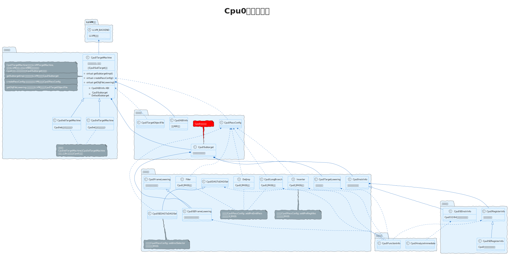
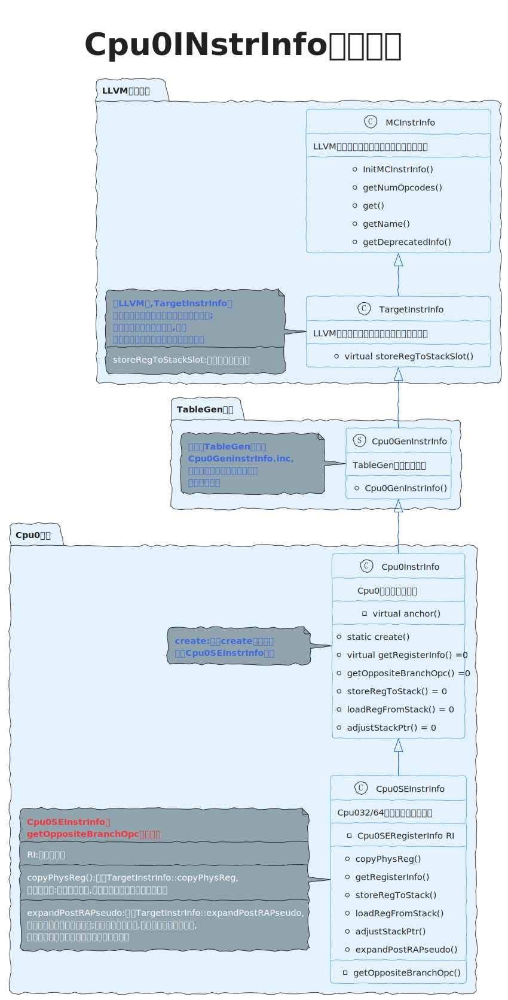

# [llvm后端学习总结](https://llvm.org/docs/CodeGenerator.html)

## 1 Cpu0后端总架构图

## 2 基础结构

### 2.1 分析Cpu0InstrInfo结构
Cpu0InstrInfo类是LLVM官方提供的[TargetInstrInfo](https://llvm.org/doxygen/classllvm_1_1TargetInstrInfo.html)关于<strong>Cpu0</strong>的实现;它的继承关系如下所示

## Cpu0后端使用LLVM提供类总结

| 类                           | 描述                                                    |
|------------------------------|---------------------------------------------------------|
| MachineInstr                 | Machine从最初以SSA形式选择产生，并一直以SSA形式出现，直到发生寄存器分配 |
| MachineBasicBlock            | 存储一系列MachineInstr指令                               |
| MachineFunction              | 存储一系列MachineBasicBlock                             |
|------------------------------|---------------------------------------------------------|
| MCStream                     |                                                         |
| MCContext                    |

| 函数                          | 描述                                                    |
|------------------------------|---------------------------------------------------------|
| BuildMI                      | * 位置: include/llvm/CodeGen/MachineInstrBuilder.h * 功能: 创建任意的机器指令 |
